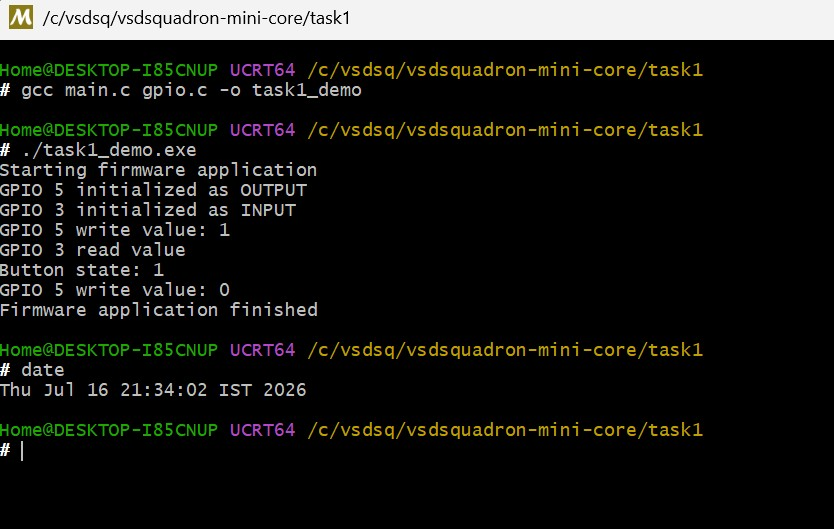

# Task 1 Submission: Firmware Foundations & Environment Setup

## What is a firmware library?

Firmware library : Collection of functions and definitions that lets the application code control hardware.

## Why are APIs important?

Because APIs are the fundamental contract between the application and a library. This separation makes code easier to read, test, reuse and port.

## What I understood from this task

- Header and source separation allows multiple applications to reuse the same driver and allows the driver implementation to evolve independently.
- `gpio.h` is the public interface that defines the GPIO directions and declares the functions that application code may call.
- `gpio.c` is the implementation which simulates hardware activity with console output and returns a fixed input value.
- `main.c` is the main application which initializes an LED pin as an output and a button pin as an input, writes the LED, reads the button, and turns the LED off without depending on the library's internal implementation.

## Build and run evidence

## Repository

[GitHub repository](https://github.com/phrakash41/vsdsquadron-mini-core/blob/main/task1/submission)
